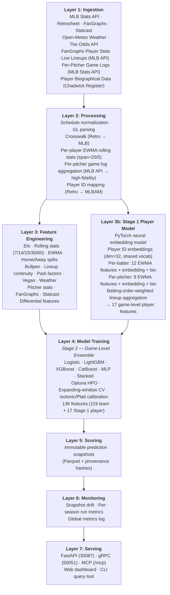
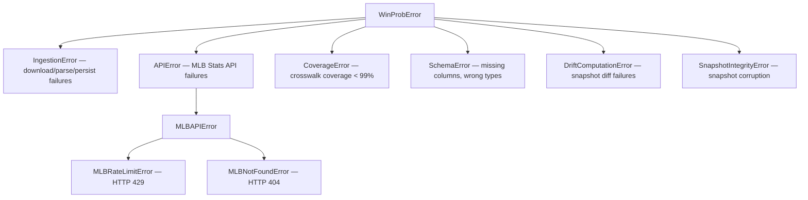

# mlb-predict Pipeline

This document is the single authoritative reference for **mlb-predict** — a research-grade, reproducible MLB win-probability modeling platform. It serves simultaneously as documentation, orchestration, and instruction for both human contributors and AI agents.

This file merges and supersedes the following standalone documents:

- `MLB_PREDICT_SPEC.md` — comprehensive technical specification
- `AGENTS.md` — engineering contract for AI agents
- `MODEL_SPEC.md` — mathematical modeling specification
- `DATA_SCHEMA.md` — on-disk data contracts and schemas
- `SYSTEM_ARCHITECTURE.md` — architecture and data flow

------------------------------------------------------------------------

## Dependencies

/require: python >= 3.11
/require: uv
/require: rg
/require: curl
/require: git

------------------------------------------------------------------------

## Configuration

/env: MODEL=stacked
/env: PORT=30087
/env: GRPC_PORT=50051
/env: YEAR=2026
/env: FEATURES_DIR=data/processed/features
/env: MODEL_DIR=data/models
/env: PROCESSED_DIR=data/processed
/env: GAMELOGS_DIR=data/processed/retrosheet
/env: PLAYER_DATA_DIR=data/processed/player

------------------------------------------------------------------------

# 1. Purpose and Scope

## 1.1 Goals

mlb-predict provides:

- **Pre-game win probability** for every MLB regular season game from 2000 to present (and pre-season 2026): `P(HomeWin | 136 features)`.
- **Predicted vs actual standings** — division standings with Pythagorean projections.
- **Upset detection** — games where the model-favoured team lost.
- **SHAP attribution** — per-game explanation of which features drove the prediction.
- **Live odds integration** — moneyline odds from The Odds API, converted to implied probabilities and expected-value (EV) opportunities.
- **Drift monitoring** — snapshot-to-snapshot probability drift across daily runs.
- **Web dashboard** — a full interactive web UI covering games, standings, leaders, players, odds.
- **REST API, gRPC API, and MCP server** — machine-readable access to all system outputs.

## 1.2 Scope

| In Scope | Out of Scope |
|---|---|
| Regular season 2000–2026 | Playoffs (excluded from training targets) |
| Spring training (down-weighted) | Real-time in-game prediction |
| Pre-game win probability | Individual player fantasy projections |
| Two-stage model (player embeddings + game ensemble) | Automated wagering |
| Individual player rolling stats (EWMA) | Minor league / prospect projections |
| Live lineup ingestion (MLB Stats API) | In-game lineup substitution modeling |
| Six trained ML models + neural player model | |
| Positive-EV bet identification | |

## 1.3 Conventions

- **Python 3.11+**: type hints on every function, PEP 257 docstrings.
- **Ruff** for linting and formatting; **mypy** for static analysis.
- **Expanding-window CV**: train on seasons < N, evaluate on N — no leakage.
- **Two-stage modeling**: Stage 1 (player embedding model) feeds Stage 2 (game-level ensemble).
- **Immutable snapshots**: prediction Parquet files are never overwritten.
- **Determinism**: identical inputs always produce identical outputs (seeded RNG, canonical sort order).
- **Provenance**: every derived artifact is traceable to its source data via SHA256 hashes.

------------------------------------------------------------------------

# 2. Architectural Principles

All agents — human or AI — must preserve the following invariants:

| # | Principle | Description |
|---|---|---|
| 1 | **Determinism** | Identical inputs produce identical outputs. |
| 2 | **Provenance** | Every derived artifact must be traceable to its sources via hashes. |
| 3 | **Immutability** | Historical prediction snapshots are never mutated or deleted. |
| 4 | **Observability** | All pipeline stages emit structured artifacts (Parquet, JSON, JSONL). |
| 5 | **Rate Safety** | External APIs must be called through bounded, token-bucket-throttled clients only. |
| 6 | **Multi-season support** | All ingestion and feature scripts accept multiple seasons per invocation. |
| 7 | **Fail-fast correctness** | Ambiguous or unexpected states must raise errors — never silently continue. |
| 8 | **Coverage enforcement** | Crosswalk match rate must be >= 99.0% per season. |
| 9 | **Storage redundancy** | Parquet (authoritative) + CSV (human inspection) where appropriate. |
| 10 | **Forward extensibility** | No architectural dead-ends; new modules must follow defined extension points. |

------------------------------------------------------------------------

# 3. High-Level Architecture

The system is organized into seven sequential layers:



## 3.1 Data Flow

### Full Pipeline

```text
MLB Stats API ──► data/raw/mlb_api/{schedule,stats,teams}/
             │
             ├─► data/processed/schedule/games_YYYY.parquet
             └─► data/processed/teams/teams_YYYY.parquet

Retrosheet (Chadwick primary / retrosheet.org fallback):
             ──► data/raw/retrosheet/gamelogs/GL<YYYY>.TXT
             └─► data/processed/retrosheet/gamelogs_YYYY.parquet

FanGraphs (via pybaseball):
             └─► data/processed/fangraphs/fangraphs_YYYY.parquet

MLB Stats API (pitcher stats):
             └─► data/processed/pitcher_stats/pitchers_YYYY.parquet

Player data (biographical, gamelogs, Statcast):
             └─► data/processed/player/biographical.parquet
             └─► data/processed/player/{batter,pitcher}_stats_YYYY.parquet
             └─► data/processed/player/pitcher_gamelogs_YYYY.parquet

schedule + gamelogs
   └─► data/processed/crosswalk/game_id_map_YYYY.parquet

crosswalk + gamelogs + pitcher_stats + fangraphs + statcast + vegas + weather
   └─► data/processed/features/features_YYYY.parquet   (136 features, historical)
   └─► data/processed/features/features_2026.parquet   (pre-season, from team state)

schedule (spring training scores) + prior-season features
   └─► data/processed/features/features_spring_YYYY.parquet  (spring training)

features ──► DuckDB store (data/processed/mlb_predict.duckdb)
         └─► model training ──► data/models/{type}_v4_train{season}/

features + model
   └─► data/processed/predictions/season=YYYY/snapshots/run_ts=<iso>.parquet
   └─► data/processed/drift/{run_metrics_YYYY,global_run_metrics}.parquet
```

### Daily Automated Update

```text
1. ingest_schedule.py  (regular + spring training)
2. ingest_retrosheet_gamelogs.py  (current season)
3. build_crosswalk.py  (current season)
4. build_features.py  (current season)
5. build_spring_features.py  (current season)
6. build_features_2026.py  (update 2026 pre-season state)
7. kill server → start fresh uvicorn instance
```

## 3.2 Execution Model

### Async + Rate Limiting

All external HTTP calls must:

- Go through async clients (`src/mlb_predict/mlbapi/client.py`)
- Be token-bucket throttled (rate=5.0 req/s, burst=10)
- Use bounded concurrency
- Implement retries with exponential backoff

No direct synchronous HTTP calls for external sources.

### Multi-Season Runs

All ingestion and feature scripts accept multiple seasons per invocation via `--seasons` (space-separated list or shell expansion). Orchestration script (`scripts/ingest_all.py`) runs all ingestion steps in sequence and exits nonzero on any failure.

## 3.3 Module Responsibilities

### `src/mlb_predict/mlbapi`

- Async Stats API wrapper
- Cache responses keyed by endpoint + params (SHA256 filename)
- Append-only `metadata.jsonl` for audit trail
- Clients: `schedule.py`, `pitcher_stats.py`, `teams.py`, `lineups.py`, `standings.py`, `leaders.py`

### `src/mlb_predict/retrosheet`

- Download + parse Retrosheet GL logs
- Multiple source support with automatic fallback
- Persist provenance metadata (source URL, raw SHA256)

### `src/mlb_predict/crosswalk`

- Deterministically map Retrosheet game rows to MLB `game_pk`
- Emit unresolved lists per season
- Produce coverage report; enforce >= 99.0% match threshold

### `src/mlb_predict/statcast`

- FanGraphs team advanced metrics via `pybaseball`
- Statcast individual batter/pitcher stats + ID mapping
- Persists `fangraphs_YYYY.parquet` (wOBA, FIP, xFIP, K%, BB%, ...)

### `src/mlb_predict/storage`

- `duckdb_store.py` — hybrid DuckDB + Parquet storage layer
- Singleton `get_store()` provides thread-safe access to the DuckDB database
- `ingest_parquet()` / `ingest_all_features()` for Parquet → DuckDB ingestion
- `query_features()` / `query_training_data()` for fast analytical reads
- `export_parquet()` for DuckDB → Parquet export (snapshots, interoperability)
- Automatic fallback: if DuckDB is unavailable, callers fall back to direct Parquet reads

### `src/mlb_predict/features`

- `elo.py` — sequential cross-season Elo with home-field HFA offset
- `team_stats.py` — rolling windows (15/30/60 games), EWMA, home/away splits, streaks, rest
- `pitcher_stats.py` — gamelog-based pitcher ERA assembly
- `park_factors.py` — median runs-per-game park factor from historical gamelogs
- `builder.py` — assembles the 136-feature matrix (119 team + 17 Stage 1 player) using `pd.concat(axis=1)` to avoid DataFrame fragmentation; saves per-season Parquet

### `src/mlb_predict/player`

- `ingestion.py` — FanGraphs player-level + expanded Statcast ingestion
- `rolling.py` — per-player EWMA rolling stats (span=20 batters, 5 pitchers)
- `biographical.py` — player bio data (age, handedness, position)
- `pitcher_gamelogs.py` — per-pitcher game log fetch/cache (MLB Stats API)
- `embeddings.py` — PyTorch player embedding model (Stage 1)
- `lineup_model.py` — Stage 1 lineup aggregation, training, inference

### `src/mlb_predict/model`

- `train.py` — logistic, LightGBM, XGBoost, CatBoost, MLP, stacked ensemble; calibration (isotonic for tree models, Platt for linear/neural); time-weighted sample weights; Optuna HPO; expanding-window CV; spring training weighting; DuckDB-accelerated feature loading with Parquet fallback; Stage 1 player embedding integration; pre-training data validation
- `evaluate.py` — Brier score, accuracy, calibration error
- `artifacts.py` — save / load model artifacts (joblib + JSON metadata)

### `src/mlb_predict/predict`

- `snapshot.py` — produces immutable prediction Parquet files with provenance hashes (`model_version`, `feature_hash`, `schedule_hash`, `git_commit`)

### `src/mlb_predict/drift`

- `compute.py` — incremental and baseline diffs; per-season and global run metrics

### `src/mlb_predict/app`

- `main.py` — FastAPI application: game browser, 2026 season page, game detail, upsets, CV summary; SHAP attribution; auto-bootstrap with DuckDB population after ingest
- `data_cache.py` — loads features via DuckDB store (fast path) or Parquet files (fallback); normalizes date types; pre-computes probabilities for all games
- `admin.py` — pipeline runner with player data ingest step
- `templates/` — Jinja2 HTML templates

### `src/mlb_predict/external`

- `odds.py` — The Odds API client
- `vegas.py` — money-line → implied probability conversion
- `weather.py` — Open-Meteo client + cache
- `betting_config.py` — betting params (Kelly %, budget, flat bet) config + persistence

### `src/mlb_predict/mcp`

- `server.py` — FastMCP server (12 tools) mounted at `/mcp`

### `src/mlb_predict/grpc`

- `server.py` — gRPC server startup/shutdown
- `services/` — GameService, ModelService, StandingsService, AdminService, SystemService
- `generated/` — auto-generated protobuf/gRPC Python stubs

------------------------------------------------------------------------

# 4. Technology Stack

## 4.1 Core Runtime

| Component | Technology |
|---|---|
| Language | Python 3.11+ |
| Build system | `hatchling`, `uv` (Astral, pinned 0.10.8) |
| Linting / formatting | `ruff` >= 0.6 |
| Type checking | `mypy` |
| Packaging | Editable install (`pip install -e .`) |

## 4.2 Web Framework

| Component | Technology |
|---|---|
| HTTP server | `FastAPI` >= 0.111, served by `uvicorn[standard]` >= 0.29 |
| Templating | `Jinja2` >= 3.1 |
| Serialization | `orjson` >= 3.9, `pydantic` |
| Async HTTP | `aiohttp` >= 3.9, `aiofiles` >= 23.2 |

## 4.3 Machine Learning

| Library | Version | Role |
|---|---|---|
| `scikit-learn` | >= 1.4 | Logistic regression, MLP, StandardScaler, IsotonicRegression, Pipeline |
| `lightgbm` | >= 4.0 | Gradient-boosted trees (GBDT) |
| `xgboost` | >= 2.0 | Gradient-boosted trees with L1/L2 regularization |
| `catboost` | >= 1.2 | Ordered boosting with symmetric trees |
| `torch` | >= 2.0 | Stage 1 player embedding model (entity embeddings, lineup aggregation) |
| `optuna` | >= 3.6 | Bayesian hyperparameter optimization (200 trials per tree model) |
| `shap` | >= 0.45 | SHAP feature attribution (`TreeExplainer` for trees) |
| `joblib` | >= 1.3 | Model serialization |
| `scipy` | >= 1.12 | Logit/sigmoid functions for calibration |
| `numpy` | >= 1.26 | Numerical arrays |
| `pandas` | >= 2.1 | DataFrames |
| `pyarrow` | >= 14.0 | Parquet I/O |
| `pybaseball` | >= 2.2 | FanGraphs team/player metrics, Statcast player stats |

## 4.4 gRPC / Protobuf

| Component | Technology |
|---|---|
| Core | `grpcio` >= 1.60, `protobuf` >= 4.25 |
| Reflection | `grpcio-reflection` >= 1.60 |
| Code generation | `grpcio-tools` (dev, build-time) via `scripts/gen_proto.sh` |

## 4.5 MCP

| Component | Technology |
|---|---|
| Framework | `fastmcp` >= 3.0 |
| Mount | Streamable HTTP at `/mcp` |

## 4.6 Testing

| Library | Role |
|---|---|
| `pytest` >= 8.0 | Test runner |
| `pytest-asyncio` >= 0.23 | Async test support (`asyncio_mode = "auto"`) |
| `pytest-mock` >= 3.12 | Mocking |
| `hypothesis` >= 6.0 | Property-based testing |
| `aioresponses` >= 0.7 | Mock async HTTP responses |

## 4.7 Container and Process Management

| Component | Technology |
|---|---|
| Container | Docker multi-stage (`python:3.11-slim`) |
| Process manager | `supervisord` |
| Cron daemon | `supercronic` v0.2.33 |
| Platforms | `linux/amd64`, `linux/arm64` |

------------------------------------------------------------------------

# 5. Directory Structure

```
mlb-predict/
├── .agent/                        # Agent infrastructure (this workflow)
│   ├── config.yaml                # Runner settings and language mapping
│   ├── runner.sh                  # Universal CLI runner
│   └── runners/                   # Language-specific execution adapters
│       ├── python.sh
│       └── shell.sh
├── .cursor/plans/                 # Cursor AI plan files
├── .github/workflows/ci.yml      # GitHub Actions CI/CD
├── docker/
│   ├── crontab                    # supercronic schedule
│   ├── entrypoint.sh              # Container startup / bootstrap detection
│   ├── ingest_daily.sh            # Daily data refresh (01:00 UTC)
│   ├── retrain_daily.sh           # Daily model retrain (20:00 UTC)
│   └── supervisord.conf           # supervisord config
├── docs/
│   └── RETROSHEET_ATTRIBUTION.md  # Retrosheet attribution notice
├── proto/mlb_predict/v1/
│   ├── admin.proto                # AdminService
│   ├── common.proto               # Shared messages
│   ├── games.proto                # GameService
│   ├── models.proto               # ModelService
│   ├── standings.proto            # StandingsService
│   └── system.proto               # SystemService
├── scripts/
│   ├── build_crosswalk.py
│   ├── build_features.py
│   ├── build_features_2026.py
│   ├── build_spring_features.py
│   ├── capture_golden_api.py
│   ├── compute_drift.py
│   ├── feature_importance.py
│   ├── gen_proto.sh
│   ├── ingest_all.py
│   ├── ingest_fangraphs.py
│   ├── ingest_odds.py
│   ├── ingest_player_data.py      # Unified player data ingestion
│   ├── ingest_pitcher_stats.py
│   ├── ingest_retrosheet_gamelogs.py
│   ├── ingest_schedule.py
│   ├── ingest_vegas.py
│   ├── ingest_weather.py
│   ├── query_game.py
│   ├── run_predictions.py
│   ├── serve.py
│   ├── train_model.py
│   └── update_daily.sh
├── src/mlb_predict/
│   ├── app/                       # FastAPI application
│   ├── crosswalk/build.py         # Retrosheet → MLB game_pk mapping
│   ├── drift/compute.py           # Drift computation
│   ├── errors.py                  # Error taxonomy
│   ├── external/                  # Odds, Vegas, Weather clients
│   ├── features/                  # Feature engineering modules
│   ├── grpc/                      # gRPC server and services
│   ├── ingest/id_map.py           # Team ID mapping
│   ├── logging_config.py          # Structured logging
│   ├── mcp/server.py              # FastMCP server (12 tools)
│   ├── mlbapi/                    # Async MLB Stats API client
│   ├── model/                     # Training, evaluation, artifacts
│   ├── player/                    # Player data pipeline (Stage 1)
│   ├── predict/snapshot.py        # Immutable snapshot writer
│   ├── retrosheet/gamelogs.py     # Retrosheet GL parser
│   ├── standings.py               # Division standings
│   ├── statcast/                  # FanGraphs and Statcast stats
│   ├── tools/                     # MCP tool dispatcher
│   └── util/hashing.py            # SHA256 utilities
├── tests/
│   ├── conftest.py
│   ├── golden/                    # Golden API response fixtures
│   ├── integration/
│   ├── property/
│   └── unit/                      # 24 unit test files (440 tests)
├── mlb-predict-pipeline.Rmd       # This agent file (single source of truth)
├── Dockerfile
├── pyproject.toml
├── README.md
└── uv.lock
```

------------------------------------------------------------------------

# 6. Data Sources

| Source | Access | Data Provided | Coverage |
|---|---|---|---|
| **MLB Stats API** (`statsapi.mlb.com`) | Async `aiohttp`, rate-limited (5 rps, burst=10), SHA256-keyed cache | Schedule, pitcher stats, standings, team stats, play-by-play, league leaders | 2000–present |
| **Retrosheet** (Chadwick primary / retrosheet.org fallback) | HTTP download of fixed-width GL text files | Historical game logs (161 columns per game) | 2000–2025 |
| **FanGraphs Team** (via `pybaseball`) | `pybaseball` library (HTTP scraping) | Team wOBA, FIP, xFIP, K%, BB%, barrel%, hard-hit% | 2002–present |
| **FanGraphs Player** (via `pybaseball`) | `pybaseball.batting_stats()`, `pitching_stats()` | Per-player wRC+, OPS, K%, BB%, ISO, BABIP, FIP, xFIP, swinging strike% | 2002–present |
| **Baseball Savant** (via `pybaseball`) | `pybaseball` library | Statcast xwOBA, xBA, xSLG, barrel%, sprint speed per batter/pitcher | 2015–present |
| **MLB Stats API Lineups** | `statsapi.mlb.com` `/game/{game_pk}/boxscore` | Confirmed batting orders (player IDs, positions, batting side) | Current season |
| **MLB Stats API Pitcher Game Logs** | `statsapi.mlb.com` `/people/{id}/stats?stats=gameLog` | Per-pitcher per-game box scores (IP, ER, H, BB, K, HR) | 2000–present |
| **Chadwick Register** | Downloaded CSV | Retrosheet → MLBAM ID crosswalk for Statcast | Full historical |
| **Open-Meteo** (`open-meteo.com`) | REST API by park coordinates | Historical temperature, wind, humidity per game/park | All seasons |
| **The Odds API** | REST API (optional, requires API key) | Live moneyline odds for EV calculation | Current season |

### MLB Stats API Client

Location: `src/mlb_predict/mlbapi/client.py`

- Async `aiohttp` client with `TokenBucket(rate=5.0, burst=10.0)`.
- All responses cached at `data/raw/mlb_api/<endpoint>/<sha256>.json`.
- Every request appended to `data/raw/mlb_api/metadata.jsonl` with fields: `ts_unix`, `url`, `params`, `cache_key`, `endpoint`, `status`.
- Retries with exponential backoff on HTTP 429 (respects `Retry-After`) and 5xx errors.
- Direct synchronous or uncached HTTP calls are **forbidden**.

### Retrosheet Gamelogs

Location: `src/mlb_predict/retrosheet/gamelogs.py`

- Downloads `GL<YYYY>.TXT` files from Chadwick (primary) with retrosheet.org as fallback.
- Parser converts 161-column fixed-width format to Parquet.
- Provenance: `source_url` and `raw_sha256` stored in metadata.

### Crosswalk (Retrosheet → MLB)

Location: `src/mlb_predict/crosswalk/build.py`

- Deterministically maps each Retrosheet game row to an MLB `game_pk` using date, home team code, and game number.
- Emits unresolved lists per season.
- **Invariant**: >= 99.0% match rate per season. Any season below threshold triggers a `CoverageError` and is flagged in `crosswalk_seasons_below_threshold.csv`.

### Player Data Pipeline (v4)

Location: `src/mlb_predict/player/ingestion.py`, `scripts/ingest_player_data.py`

Unified player data ingestion for the Stage 1 player embedding model. Combines multiple sources per player per season.

**Batter data (per player, per season):**

| Stat | Source | Coverage | Fallback |
|---|---|---|---|
| OPS | Gamelog H/AB/BB/2B/3B/HR | 2000+ | League avg (0.728) |
| ISO | Gamelog extra-base hits | 2000+ | League avg (0.150) |
| K% | Gamelog SO/PA | 2000+ | League avg (0.220) |
| BB% | Gamelog BB/PA | 2000+ | League avg (0.085) |
| wRC+ | FanGraphs `batting_stats()` | 2002+ | OPS-based estimate |
| xwOBA | Statcast `statcast_batter_expected_stats()` | 2015+ | wOBA proxy |
| barrel% | Statcast `statcast_batter_exitvelo_barrels()` | 2015+ | ISO proxy |
| hard hit% | Statcast `statcast_batter_exitvelo_barrels()` | 2015+ | League avg (0.380) |
| sprint speed | Statcast | 2015+ | League avg (27.0 ft/s) |

**Pitcher data (per player, per season):**

| Stat | Source | Coverage | Fallback |
|---|---|---|---|
| ERA | MLB API pitcher game logs (primary) / Retrosheet approximation (fallback) | 2000+ | League avg (4.50) |
| FIP | FanGraphs `pitching_stats()` / computed from K/BB/HR | 2002+ | ERA proxy |
| K/9 | MLB API pitcher game logs (primary) / Retrosheet approximation (fallback) | 2000+ | League avg (8.5) |
| BB/9 | MLB API pitcher game logs (primary) / Retrosheet approximation (fallback) | 2000+ | League avg (3.0) |
| xwOBA allowed | Statcast `statcast_pitcher_expected_stats()` | 2015+ | League avg (0.320) |
| WHIP | MLB API pitcher game logs (primary) / Retrosheet approximation (fallback) | 2000+ | League avg (1.30) |
| swinging strike % | Statcast | 2015+ | League avg (0.110) |

**Biographical data (per player):**

| Stat | Source | Coverage |
|---|---|---|
| Batting side | Chadwick register / MLB API | All players |
| Throwing side | Chadwick register / MLB API | All players |
| Birth date (→ age) | Chadwick register / MLB API | All players |
| Position category | Roster/lineup data | All players |

**Rolling computation:** EWMA with span=20 games (batters) and span=5 starts (pitchers). Cross-season warm-start: end-of-previous-season EWMA state seeds the beginning of the next season.

**Pitcher rolling data sources (two-tier):**

1. **High-fidelity (MLB Stats API)**: Per-pitcher game logs fetched via `pitcher_gamelogs.py` provide exact per-game IP, ER, H, BB, K, and HR.
2. **Fallback (Retrosheet gamelogs)**: When API game logs are unavailable, pitcher stats are approximated from team-level Retrosheet gamelogs. Innings pitched estimated from per-team putouts (`home_po / 3.0` and `visiting_po / 3.0`).

**ID mapping:** Retrosheet player IDs → MLBAM IDs via Chadwick register.

### Live Lineup Data (v4)

Location: `src/mlb_predict/mlbapi/lineups.py`

- **Historical training**: uses Retrosheet `home_1_id..home_9_id` and `visiting_1_id..visiting_9_id`.
- **Current-season scoring**: fetches confirmed batting orders from MLB Stats API `game/{game_pk}/boxscore` endpoint ~2–4 hours before first pitch.
- **Fallback**: if day-of lineup not yet posted, uses previous game's lineup for that team.

------------------------------------------------------------------------

# 7. Data Layer and Schemas

## 7.1 Storage Conventions

- Every processed dataset is written in **Parquet** (authoritative, typed) and optionally **CSV** (human inspection).
- Parquet files use stable column ordering and deterministic row ordering.
- `game_pk` (MLB Stats API) is the canonical game identifier.
- Checksum files (`*.checksum.json`) include row counts, SHA256 of artifacts, source selection fields, and relevant configuration.
- Feature data is ingested into a **DuckDB** analytical database (`data/processed/mlb_predict.duckdb`) for fast multi-season queries during training and serving. Parquet files remain the canonical source of truth; DuckDB is populated from them and can be rebuilt at any time.

## 7.2 Raw Data Layout

```
data/raw/
├── mlb_api/
│   ├── <endpoint>/
│   │   └── <sha256>.json              # Cached API response
│   └── metadata.jsonl                 # Append-only audit log
└── retrosheet/
    └── gamelogs/
        └── GL<YYYY>.TXT               # Retrosheet game log (raw)
```

### metadata.jsonl Schema

| Field | Type | Required | Notes |
|---|---:|---:|---|
| `ts_unix` | float | yes | Unix timestamp |
| `url` | string | yes | Request URL |
| `params` | object | yes | Query params |
| `cache_key` | string | yes | SHA256 over endpoint+params |
| `endpoint` | string | yes | Endpoint name |
| `status` | int | yes | HTTP status |

Invariants: `metadata.jsonl` is append-only. Cached payload filenames are deterministic from `(endpoint, params)`.

## 7.3 Processed Data Schemas

### Schedule

Path: `data/processed/schedule/games_<season>.parquet`

| Column | Type | Required | Notes |
|---|---|---:|---|
| `game_pk` | int64 | yes | canonical game id |
| `season` | int32 | yes | season |
| `game_date_utc` | string | yes | ISO 8601 |
| `game_date_local` | string | no | ISO 8601, derived via venue tz |
| `home_mlb_id` | int32 | yes | team id |
| `away_mlb_id` | int32 | yes | team id |
| `home_abbrev` | string | yes | from teams endpoint |
| `away_abbrev` | string | yes | from teams endpoint |
| `venue_id` | int32 | no | venue id |
| `local_timezone` | string | no | IANA tz |
| `double_header` | string | no | Stats API field |
| `game_number` | int32? | no | DH number when present |
| `status` | string | no | e.g., Scheduled |
| `game_type` | string | yes | `R` = regular season, `S` = spring training |
| `home_score` | int32? | no | Final home team score (completed games) |
| `away_score` | int32? | no | Final away team score (completed games) |

### Retrosheet Game Logs

Path: `data/processed/retrosheet/gamelogs_<season>.parquet`

Columns follow the Retrosheet GL format. Mandatory normalized fields:

| Column | Type | Required |
|---|---|---:|
| `date` | date | yes |
| `game_num` | int32? | yes |
| `visiting_team` | string | yes |
| `home_team` | string | yes |
| `visiting_score` | int32? | no |
| `home_score` | int32? | no |
| `visiting_starting_pitcher_id` | string | no |
| `home_starting_pitcher_id` | string | no |

### Crosswalk

Path: `data/processed/crosswalk/game_id_map_<season>.parquet`

| Column | Type | Required |
|---|---|---:|
| `date` | date | yes |
| `home_mlb_id` | int32 | yes |
| `away_mlb_id` | int32 | yes |
| `home_retro` | string | yes |
| `away_retro` | string | yes |
| `dh_game_num` | int32? | no |
| `status` | string | yes |
| `mlb_game_pk` | int64? | no |
| `match_confidence` | float | yes |
| `notes` | string | yes |

Coverage invariants: minimum **99.0% matched**. Any season below threshold MUST be flagged in `crosswalk_seasons_below_threshold.csv`.

### Pitcher Stats

Path: `data/processed/pitcher_stats/pitchers_<season>.parquet`

| Column | Type | Notes |
|---|---|---|
| `player_id` | int64 | MLB Stats API player ID |
| `player_name` | string | Full name |
| `season` | int64 | Season |
| `era` | float64 | Earned Run Average |
| `k9` | float64 | Strikeouts per 9 innings |
| `bb9` | float64 | Walks per 9 innings |
| `fip_raw` | float64 | Raw FIP |
| `whip` | float64 | WHIP |
| `ip` | float64 | Innings pitched |
| `games_started` | int64 | Games started |

### FanGraphs Team Metrics

Path: `data/processed/fangraphs/fangraphs_<season>.parquet`

| Column | Type | Notes |
|---|---|---|
| `team_fg` | string | FanGraphs team abbreviation |
| `season` | int64 | Season |
| `bat_woba` | float64 | Team weighted on-base average |
| `bat_iso` | float64 | Isolated power |
| `bat_babip` | float64 | BABIP |
| `bat_hard_pct` | float64 | Hard Hit % |
| `bat_barrel_pct` | float64 | Barrel % |
| `bat_xwoba` | float64 | Expected wOBA |
| `pit_fip` | float64 | FIP |
| `pit_xfip` | float64 | Expected FIP |
| `pit_k_pct` | float64 | Team strikeout % |
| `pit_bb_pct` | float64 | Team walk % |
| `pit_hr_fb` | float64 | HR/FB ratio |
| `pit_whip` | float64 | Team WHIP |

### Features (136-feature matrix)

Path: `data/processed/features/features_<season>.parquet`

| Column | Type | Notes |
|---|---|---|
| `game_pk` | int64 | Canonical game identifier |
| `is_spring` | float64 | 1.0 for spring training, 0.0 for regular season |
| `date` | object (`datetime.date`) | Game date (local) |
| `season` | int64 | Season |
| `game_type` | string | `R` = regular season, `S` = spring training |
| `home_retro`, `away_retro` | string | Retrosheet team codes |
| `home_win` | float64 | 1.0 / 0.0 / NaN (NaN for 2026 pre-season) |
| `feature_hash` | string | SHA256 of numeric feature values |
| `schema_version` | string | Feature schema version (`v4`) |
| *(136 numeric features)* | float64 | See Feature Engineering (section 8) |

Invariants:

- Total columns: ~143 (136 model features + identifiers + `home_win` + `feature_hash`)
- `date` column dtype is always `datetime.date` (never plain string)
- 2026 rows have `home_win = NaN`; all 136 feature columns are populated from 2025 end-of-season team state
- Stage 1 player embedding features (17 columns) are 0.0 when player data is unavailable

### Prediction Snapshots

Path: `data/processed/predictions/season=YYYY/snapshots/run_ts=<iso>_<model>.parquet`

| Column | Type | Description |
|---|---|---|
| `game_pk` | int64 | MLB game identifier |
| `home_team` | string | Home team Retrosheet code |
| `away_team` | string | Away team Retrosheet code |
| `predicted_home_win_prob` | float64 | Model output probability in [0, 1] |
| `run_ts_utc` | string | ISO timestamp of this run |
| `model_version` | string | e.g. `stacked_v4_train2025` |
| `schedule_hash` | string | SHA256 of the schedule Parquet |
| `feature_hash` | string | SHA256 of the feature Parquet |
| `git_commit` | string | HEAD commit SHA |
| `tag` | string | Optional semantic version tag |

Snapshots are **never overwritten**. Each daily run appends a new file.

### Drift Artifacts

Per-season: `data/processed/drift/run_metrics_<season>.parquet`
Global: `data/processed/drift/global_run_metrics.parquet`

| Column | Type | Notes |
|---|---|---|
| `run_ts_utc` | string | ISO 8601 UTC timestamp |
| `model_version` | string | e.g. `xgboost_v4_train2025` |
| `season` | int64 | Season evaluated |
| `n_games` | int64 | Games in diff |
| `mean_abs_delta` | float64 | Mean |p_new − p_old| |
| `p95_abs_delta` | float64 | 95th percentile |delta| |
| `max_abs_delta` | float64 | Maximum |delta| |
| `pct_gt_0p01` | float64 | % of games with |delta| > 0.01 |
| `pct_gt_0p02` | float64 | % of games with |delta| > 0.02 |
| `pct_gt_0p05` | float64 | % of games with |delta| > 0.05 |

### Manual Mapping File

Path: `data/processed/team_id_map_retro_to_mlb.csv`

| Column | Type | Required | Notes |
|---|---|---:|---|
| `retro_team_code` | string | yes | e.g., LAN |
| `mlb_team_id` | int32 | yes | Stats API team id |
| `mlb_abbrev` | string | no | convenience |
| `valid_from_season` | int32 | yes | inclusive |
| `valid_to_season` | int32 | yes | inclusive |

Invariant: for any `(retro_team_code, season)` there MUST be exactly one mapping row.

### Determinism Requirements

Any module generating derived data MUST:

- Sort rows deterministically before writing
- Avoid unordered set/dict iteration in output generation
- Record config and hashes sufficient to reproduce

------------------------------------------------------------------------

# 8. Feature Engineering

The system produces a **136-feature vector** per game. All features are constructed exclusively from data available before first pitch (no lookahead leakage). Features must be deterministic and stable across schema version `v4`.

Features must satisfy:

- Derived only from data available at scoring time (no leakage)
- Deterministic computation
- Stable schema versioning (see `data/models/cv_summary_v4.json`)

## 8.1 Feature Groups

### 8.1.1 Elo Ratings (3 features)

Location: `src/mlb_predict/features/elo.py`

Sequential cross-season Elo ratings with K=20 and home-field advantage (HFA) offset of +35.

| Feature | Description |
|---|---|
| `home_elo` | Elo rating of the home team before this game |
| `away_elo` | Elo rating of the away team before this game |
| `elo_diff` | `home_elo − away_elo` |

Ratings persist across season boundaries (no reset). Computed sequentially in chronological order. HFA offset applied only to expected-score calculation.

### 8.1.2 Multi-Window Rolling Stats (30 features)

Location: `src/mlb_predict/features/team_stats.py`

Rolling windows of **7, 14, 15, 30, and 60** games. Applied separately to home and away teams; differentials computed for selected windows. Cross-season warm-start: end-of-previous-season state seeds first window of next season.

| Feature Group | Windows | Features |
|---|---|---|
| Win percentage | 7, 14, 15, 30, 60 | `home_win_pct_7..60`, `away_win_pct_*` |
| Run differential | 7, 14, 15, 30, 60 | `home_run_diff_7..60`, `away_run_diff_*` |
| Pythagorean expectation | 7, 14, 15, 30, 60 | `home_pythag_7..60`, `away_pythag_*` |

Pythagorean exponent: 1.83 (standard baseball formula).

**Note:** 7-game and 14-game window features (12 total) are highly correlated (r > 0.95) with the 15-game equivalents and are excluded from tree-model training by default via `select_features()`. They are still computed and stored for logistic regression and MLP.

### 8.1.3 EWMA Rolling Stats (7 features)

Location: `src/mlb_predict/features/team_stats.py`

Exponentially weighted moving averages with span=20 games.

| Feature | Description |
|---|---|
| `home_win_ewm` | EWMA win percentage (home team) |
| `away_win_ewm` | EWMA win percentage (away team) |
| `home_rd_ewm` | EWMA run differential (home team) |
| `away_rd_ewm` | EWMA run differential (away team) |
| `home_pythag_ewm` | EWMA Pythagorean (home team) |
| `away_pythag_ewm` | EWMA Pythagorean (away team) |
| `pythag_ewm_diff` | `home_pythag_ewm − away_pythag_ewm` |

### 8.1.4 Home/Away Performance Splits (6 features)

| Feature | Description |
|---|---|
| `home_win_pct_home_only` | Rolling win% in home games only (home team) |
| `away_win_pct_away_only` | Rolling win% in road games only (away team) |
| `home_pythag_home_only` | Rolling Pythagorean in home games (home team) |
| `away_pythag_away_only` | Rolling Pythagorean in road games (away team) |
| `home_away_split_diff` | `home_win_pct_home_only − away_win_pct_away_only` |
| `pythag_ha_diff` | `home_pythag_home_only − away_pythag_away_only` |

### 8.1.5 Run Distribution (4 features)

| Feature | Description |
|---|---|
| `home_run_std_30` | Standard deviation of runs scored over 30 games (home) |
| `away_run_std_30` | Standard deviation of runs scored over 30 games (away) |
| `home_one_run_win_pct_30` | Win % in one-run games over 30 games (home) |
| `away_one_run_win_pct_30` | Win % in one-run games over 30 games (away) |

### 8.1.6 Streaks, Rest, and Context (9 features)

| Feature | Description |
|---|---|
| `home_streak` | Current win (+) / loss (−) streak |
| `away_streak` | Current win (+) / loss (−) streak |
| `home_rest_days` | Days since last game (capped at 10) |
| `away_rest_days` | Days since last game (capped at 10) |
| `season_progress` | `game_index / total_games` — 0.0 to 1.0 |
| `day_night` | 1.0 for night games, 0.0 for day games |
| `interleague` | 1.0 for interleague matchups |
| `day_of_week` | 0.0–1.0 (Monday=0.0, Sunday=1.0, normalized by /6) |
| `is_spring` | 1.0 for spring training, 0.0 for regular season |

### 8.1.7 Starting Pitcher Quality (8 features)

Location: `src/mlb_predict/features/pitcher_stats.py`

| Feature | Description |
|---|---|
| `home_sp_era` | Starting pitcher ERA (home, prior season) |
| `away_sp_era` | Starting pitcher ERA (away, prior season) |
| `home_sp_k9` | Strikeouts per 9 innings (home SP) |
| `away_sp_k9` | Strikeouts per 9 innings (away SP) |
| `home_sp_bb9` | Walks per 9 innings (home SP) |
| `away_sp_bb9` | Walks per 9 innings (away SP) |
| `home_sp_whip` | WHIP (home SP) |
| `sp_era_diff` | `away_sp_era − home_sp_era` (positive = home advantage) |

### 8.1.8 FanGraphs Advanced Team Metrics (24 features)

Location: `src/mlb_predict/statcast/fangraphs.py`

**Batting (6 stats x 2 teams = 12 features):** `bat_woba`, `bat_barrel_pct`, `bat_hard_pct`, `bat_iso`, `bat_babip`, `bat_xwoba` for home and away.

**Pitching (6 stats x 2 teams = 12 features):** `pit_fip`, `pit_xfip`, `pit_k_pct`, `pit_bb_pct`, `pit_hr_fb`, `pit_whip` for home and away.

Default fallback values: `bat_woba=0.320`, `bat_barrel_pct=0.08`, `bat_hard_pct=0.38`, `bat_iso=0.170`, `bat_babip=0.300`, `bat_xwoba=0.320`, `pit_fip=4.20`, `pit_xfip=4.20`, `pit_k_pct=0.22`, `pit_bb_pct=0.085`, `pit_hr_fb=0.11`, `pit_whip=1.30`.

### 8.1.9 Statcast Individual Stats (6 features)

Location: `src/mlb_predict/statcast/player_stats.py`

| Feature | Description |
|---|---|
| `home_lineup_xwoba`, `away_lineup_xwoba` | Lineup-weighted xwOBA (prior season) |
| `home_lineup_barrel_pct`, `away_lineup_barrel_pct` | Lineup-weighted barrel% (prior season) |
| `home_sp_est_woba`, `away_sp_est_woba` | Estimated xwOBA allowed by SP (prior season) |

### 8.1.10 Bullpen (8 features)

Location: `src/mlb_predict/features/bullpen.py`

| Feature | Description |
|---|---|
| `home_bullpen_usage_15`, `home_bullpen_usage_30` | Bullpen IP per game (home, 15/30 window) |
| `away_bullpen_usage_15`, `away_bullpen_usage_30` | Bullpen IP per game (away, 15/30 window) |
| `home_bullpen_era_15`, `home_bullpen_era_30` | Bullpen ERA proxy (home, 15/30 window) |
| `away_bullpen_era_15`, `away_bullpen_era_30` | Bullpen ERA proxy (away, 15/30 window) |

### 8.1.11 Lineup Continuity (2 features)

| Feature | Description |
|---|---|
| `home_lineup_continuity` | Fraction of prior game's lineup retained (home) |
| `away_lineup_continuity` | Fraction of prior game's lineup retained (away) |

### 8.1.12 Park Factor (1 feature)

| Feature | Description |
|---|---|
| `park_run_factor` | Median runs-per-game at venue vs league average |

### 8.1.13 Vegas Implied Probability (2 features)

| Feature | Description |
|---|---|
| `vegas_implied_home_win` | Home team implied win probability from opening moneyline |
| `vegas_line_movement` | Change in implied probability from opening to close |

### 8.1.14 Weather (3 features)

| Feature | Description |
|---|---|
| `game_temp_f` | Game-time temperature (deg F) |
| `game_wind_mph` | Wind speed (mph) |
| `game_humidity` | Relative humidity (%) |

### 8.1.15 Differential Features (12 features, computed)

| Feature | Formula |
|---|---|
| `pythag_diff_30` | `home_pythag_30 − away_pythag_30` |
| `pythag_diff_ewm` | `home_pythag_ewm − away_pythag_ewm` |
| `home_away_split_diff` | `home_win_pct_home_only − away_win_pct_away_only` |
| `sp_era_diff` | `away_sp_era − home_sp_era` (positive = home advantage) |
| `woba_diff` | `home_bat_woba − away_bat_woba` |
| `fip_diff` | `away_pit_fip − home_pit_fip` (positive = home advantage) |
| `xwoba_diff` | `home_bat_xwoba − away_bat_xwoba` |
| `whip_diff` | `away_pit_whip − home_pit_whip` (positive = home advantage) |
| `iso_diff` | `home_bat_iso − away_bat_iso` |
| `lineup_strength_diff` | `home_lineup_strength − away_lineup_strength` (Stage 1) |
| `sp_quality_diff` | `home_sp_quality − away_sp_quality` (Stage 1) |
| `matchup_advantage_diff` | `home_lineup_vs_sp − away_lineup_vs_sp` (Stage 1) |

### 8.1.16 Stage 1 Player Model Features (14 + 3 differentials = 17 features)

Location: `src/mlb_predict/player/lineup_model.py`, `src/mlb_predict/player/embeddings.py`

| Feature | Description |
|---|---|
| `home_lineup_strength`, `away_lineup_strength` | Neural lineup quality score (0–1) |
| `home_top3_quality`, `away_top3_quality` | Average quality of batters 1–3 |
| `home_bottom3_quality`, `away_bottom3_quality` | Average quality of batters 7–9 |
| `home_lineup_variance`, `away_lineup_variance` | Std dev of player quality across lineup |
| `home_platoon_advantage`, `away_platoon_advantage` | Learned platoon interaction vs opposing SP |
| `home_sp_quality`, `away_sp_quality` | Neural SP quality score |
| `home_lineup_vs_sp`, `away_lineup_vs_sp` | Matchup interaction: lineup vs opposing SP |

Differentials (`lineup_strength_diff`, `sp_quality_diff`, `matchup_advantage_diff`) listed in 8.1.15.

## 8.2 Feature Count Summary

| Group | Count |
|---|---|
| Elo ratings | 3 |
| Multi-window rolling (7/14/15/30/60 x win%, run diff, Pythagorean x 2 teams) | 30 |
| EWMA rolling (span=20, win%, run diff, Pythagorean x 2 teams) | 6 |
| Home/away performance splits | 4 |
| Run distribution (std, one-run win%) | 4 |
| Streaks and rest days | 4 |
| Starting pitcher stats (ERA, K/9, BB/9, WHIP) | 8 |
| FanGraphs batting (6 stats x 2 teams) | 12 |
| FanGraphs pitching (6 stats x 2 teams) | 12 |
| Statcast lineup-weighted (xwOBA, barrel% x 2 teams) | 4 |
| Statcast SP estimated xwOBA allowed | 2 |
| Lineup continuity | 2 |
| Bullpen (usage + ERA proxy x 15/30 x 2 teams) | 8 |
| Park run factor | 1 |
| Season progress | 1 |
| Contextual (day/night, interleague, day of week) | 3 |
| Vegas (implied probability, line movement) | 2 |
| Weather (temperature, wind, humidity) | 3 |
| Spring training indicator | 1 |
| Differential features (9 team + 3 player) | 12 |
| **Stage 1 player model outputs** | **14** |
| **Total** | **136** |

------------------------------------------------------------------------

# 9. Modeling

## 9.1 Problem Formulation

Binary classification using a two-stage architecture: for each pre-game, estimate `P(HomeWin | x_g)` where `x_g` is a 136-dimensional feature vector.

**Stage 1** (Player Model): PyTorch neural embedding model processes per-player EWMA stats and learned player ID embeddings to produce 17 game-level player features.

**Stage 2** (Game Ensemble): six-model ensemble consumes all 136 features to produce calibrated win probabilities.

Output is a calibrated probability in [0, 1]. Evaluated by Brier score, accuracy, and calibration error. All reported metrics are fully out-of-sample (expanding-window CV).

## 9.2 Stage 1: Player Embedding Model

Location: `src/mlb_predict/player/embeddings.py`, `src/mlb_predict/player/lineup_model.py`

A PyTorch neural network that learns dense player representations and produces game-level lineup/pitcher quality features. Trained end-to-end on binary win/loss target.

**Embedding Vocabulary:** ~20,000 unique MLBAM player IDs (2000–2026). Embedding dimension: 32. Shared vocabulary for batters and pitchers.

**Batting order weights:** `[1.20, 1.15, 1.10, 1.05, 1.00, 0.95, 0.90, 0.85, 0.80]` (normalized to sum 1.0).

**Cold-start strategy:** Players not in training vocabulary receive stat-to-embedding fallback via projection networks. Auxiliary regularization loss: `lambda * (||e_learned - e_predicted||^2)` (default lambda = 0.01). Players with fewer than 20 PA (batters) or 3 starts (pitchers) receive linearly blended embeddings.

**Training config:** AdamW optimizer, lr=1e-3, weight decay=1e-4, batch=512, max epochs=50, early stopping patience=5, dropout=0.2, seed=42.

**Artifacts:** `data/models/player_embedding_v4_train<YYYY>/model.pt`, `vocab.json`, `metadata.json`.

## 9.3 Stage 2 Training Protocol

All six game-level models share the same protocol:

1. **Expanding-window CV**: train on seasons < N, evaluate on N. No future data leaks.
2. **Time-weighted sample weights**: exponential decay at `rate=0.12` per season.
3. **Spring training weighting**: spring games receive `0.25x` weight (configurable via `--spring-weight`).
4. **Pre-training validation**: all seasons 2000–current must have schedule and feature files.
5. **Feature selection**: `select_features()` prunes 12 redundant short-window features for tree models.
6. **Calibration split**: 85/15 split. First half calibrates base models; second half fits the stacked meta-learner.
7. **Artifact versioning**: current production version is `v4`.
8. **Two-stage ordering**: Stage 1 must complete before Stage 2.
9. **O(n) Stage 1 pre-computation**: single expanding-window pass generates all Stage 1 features.

## 9.4 Two-Stage Training Pipeline

```
1. Ingest player data (FanGraphs, Statcast, biographical, pitcher game logs)
2. Compute per-player EWMA rolling stats (span=20 batters, span=5 pitchers)
3. Pre-compute Stage 1 features (O(n) expanding-window pass):
   a. For each evaluation season N (chronologically):
      - Train Stage 1 on player data from seasons < N
      - Generate Stage 1 features for season N
   b. Inject all Stage 1 features into in-memory feature DataFrames
4. Build v4 feature matrix (existing 119 features + 17 Stage 1 outputs)
5. Run Optuna HPO for tree models (200 trials each)
6. Train Stage 2 game-level models (6-model ensemble, 136 features)
7. Run expanding-window CV and compute metrics
```

## 9.5 Stage 2 Models

### Logistic Regression (baseline)

`p_g = sigma(w^T z_g + b)` where `z_g` is z-score normalized.
L2 (ridge), C=1.0. L-BFGS solver, 1000 iterations. Platt calibration. SHAP from `coef x z-score`.

### LightGBM

200-trial Optuna Bayesian search. Typical: `num_leaves~63`, `lr~0.05`, `n_estimators~500`. Isotonic calibration. `shap.TreeExplainer`.

### XGBoost

200-trial Optuna Bayesian search. Typical: `max_depth~6`, `lr~0.05`, `n_estimators~500`. Isotonic calibration. `shap.TreeExplainer`.

### CatBoost

Ordered boosting with symmetric (oblivious) trees. L2 leaf regularization. Isotonic calibration. `train_dir` hardcoded to `/tmp/catboost_info` for Docker.

### MLP (Neural Network)

128 → 64 → 32 → 1, ReLU activations, Adam optimizer. Z-score normalization. Platt calibration. No SHAP (coefficient ranking).

### Stacked Ensemble (default production model)

Meta-learner: `LogisticRegression(C=0.5)` over calibrated base-model probabilities. Never sees raw features. Achieves best Brier score and calibration.

## 9.6 Evaluation Metrics

| Metric | Description |
|---|---|
| **Brier score** | Mean squared probability error: `E[(p − y)^2]`. Lower = better. |
| **Accuracy** | % of games where the model's favourite (p > 0.5) won. |
| **Calibration error** | Mean absolute deviation between predicted probability bins and observed win rate. |

## 9.7 Model Versioning

- **Major** (`v1 → v2 → v3 → v4`): feature schema changes.
- **Minor**: new features or calibration approach within same schema.
- **Patch**: bug fixes without schema changes.

Artifact paths: `data/models/<type>_v4_train<YYYY>/model.joblib` + `metadata.json`.

------------------------------------------------------------------------

# 10. Pipeline Execution

## Phase 1: Data Ingestion

/ai: verify that network connectivity is available for MLB Stats API, Retrosheet (Chadwick), and FanGraphs before proceeding with ingestion.

### Full Ingestion (all seasons 2000–present)

/assert: test -d data
/run: scripts/ingest_all.py --seasons 2000 2001 2002 2003 2004 2005 2006 2007 2008 2009 2010 2011 2012 2013 2014 2015 2016 2017 2018 2019 2020 2021 2022 2023 2024 2025

### Pitcher Stats

/run: scripts/ingest_pitcher_stats.py --seasons 2000 2001 2002 2003 2004 2005 2006 2007 2008 2009 2010 2011 2012 2013 2014 2015 2016 2017 2018 2019 2020 2021 2022 2023 2024 2025

### FanGraphs Team Metrics

/run: scripts/ingest_fangraphs.py --seasons 2002 2003 2004 2005 2006 2007 2008 2009 2010 2011 2012 2013 2014 2015 2016 2017 2018 2019 2020 2021 2022 2023 2024 2025

### Player Data (FanGraphs, Statcast, biographical, pitcher game logs)

/run: scripts/ingest_player_data.py --start 2000 --end 2025

### Weather

/run: scripts/ingest_weather.py

### Postconditions

/assert: test -f data/processed/schedule/games_2025.parquet
/assert: test -f data/processed/retrosheet/gamelogs_2025.parquet
/assert: test -f data/processed/crosswalk/game_id_map_2025.parquet
/assert: test -f data/processed/pitcher_stats/pitchers_2025.parquet
/assert: test -f data/processed/fangraphs/fangraphs_2025.parquet
/assert: test -f data/processed/player/biographical.parquet

------------------------------------------------------------------------

## Phase 2: Feature Engineering

### Build Crosswalk (all seasons)

/run: scripts/build_crosswalk.py --seasons 2000 2001 2002 2003 2004 2005 2006 2007 2008 2009 2010 2011 2012 2013 2014 2015 2016 2017 2018 2019 2020 2021 2022 2023 2024 2025

### Build Feature Matrices (regular season)

/run: scripts/build_features.py --seasons 2000 2001 2002 2003 2004 2005 2006 2007 2008 2009 2010 2011 2012 2013 2014 2015 2016 2017 2018 2019 2020 2021 2022 2023 2024 2025

### Build Spring Training Features

/run: scripts/build_spring_features.py --seasons 2000 2001 2002 2003 2004 2005 2006 2007 2008 2009 2010 2011 2012 2013 2014 2015 2016 2017 2018 2019 2020 2021 2022 2023 2024 2025 2026

### Build 2026 Pre-Season Features

/if: test "$YEAR" = "2026"
/run: scripts/build_features_2026.py
/endif

### Postconditions

/assert: test -f data/processed/features/features_2025.parquet

------------------------------------------------------------------------

## Phase 3: Model Training

/ai: before training, confirm that all required season feature files exist from 2000 to 2025. list any missing files.

### Train All Models (with HPO)

/run: scripts/train_model.py --hpo --hpo-trials 200 --models logistic lightgbm xgboost catboost mlp stacked --spring-weight 0.25

### Train Without HPO (faster, uses cached hyperparameters)

/run: scripts/train_model.py --models logistic lightgbm xgboost catboost mlp stacked --spring-weight 0.25

### Postconditions

/assert: ls data/models/stacked_v*_train*/model.joblib > /dev/null 2>&1
/assert: ls data/models/logistic_v*_train*/model.joblib > /dev/null 2>&1
/assert: ls data/models/lightgbm_v*_train*/model.joblib > /dev/null 2>&1
/assert: ls data/models/xgboost_v*_train*/model.joblib > /dev/null 2>&1

------------------------------------------------------------------------

## Phase 4: Prediction Scoring

### Generate Predictions for Current Season

/run: scripts/run_predictions.py --season $YEAR --model-type stacked

### Generate Predictions for Historical Season

/run: scripts/run_predictions.py --season 2025 --model-type stacked

### Postconditions

/assert: test -d data/processed/predictions

------------------------------------------------------------------------

## Phase 5: Drift Monitoring

/on-error: continue

/run: scripts/compute_drift.py --season $YEAR --model-type stacked

/on-error: halt

------------------------------------------------------------------------

## Phase 6: Serving

### Start Web Dashboard

/run: scripts/serve.py --model $MODEL --host 127.0.0.1 --port $PORT

### Start with gRPC Disabled

/run: scripts/serve.py --model $MODEL --host 127.0.0.1 --port $PORT --no-grpc

------------------------------------------------------------------------

# 11. Daily Update Pipeline

This pipeline runs daily during the MLB season. It refreshes yesterday's results, rebuilds features for the current season, and restarts the web server.

/env: DAILY_YEAR=2026

### Step 1: Refresh schedule (regular + spring training)

/run: scripts/ingest_schedule.py --seasons $DAILY_YEAR --refresh-mlbapi

### Step 2: Refresh Retrosheet gamelogs

/run: scripts/ingest_retrosheet_gamelogs.py --seasons $DAILY_YEAR --refresh

### Step 3: Rebuild crosswalk

/run: scripts/build_crosswalk.py --seasons $DAILY_YEAR

### Step 4: Rebuild features

/run: scripts/build_features.py --seasons $DAILY_YEAR

### Step 5: Rebuild spring features

/run: scripts/build_spring_features.py --seasons $DAILY_YEAR

### Step 6: Update 2026 pre-season state

/if: test "$DAILY_YEAR" = "2026"
/run: scripts/build_features_2026.py
/endif

### Step 7: Restart server

/run: scripts/serve.py --model $MODEL --host 127.0.0.1 --port $PORT

------------------------------------------------------------------------

# 12. Testing

### Run All Tests

/run:inline shell
```bash
uv run pytest tests/ -v --tb=short
```

### Run Unit Tests Only

/run:inline shell
```bash
uv run pytest tests/unit/ -v
```

### Run Integration Tests Only

/run:inline shell
```bash
uv run pytest tests/integration/ -v
```

### Run Property Tests Only

/run:inline shell
```bash
uv run pytest tests/property/ -v
```

### Test Structure

```
tests/
├── conftest.py                  # Shared fixtures
├── golden/                      # Golden API response fixtures
├── integration/
│   ├── test_chat_api.py
│   ├── test_golden_api.py       # Golden API regression tests
│   └── test_odds_api.py
├── property/
│   └── test_properties.py       # Hypothesis property-based tests
└── unit/                        # 24 unit test files (440 tests)
    ├── test_admin_pipeline.py
    ├── test_bootstrap_progress.py
    ├── test_bugfixes.py
    ├── test_crosswalk.py
    ├── test_game_feed.py
    ├── test_gamelogs.py
    ├── test_hashing.py
    ├── test_id_map.py
    ├── test_leaders.py
    ├── test_mcp_resilience.py
    ├── test_mcp_server.py
    ├── test_mlbapi_client.py
    ├── test_odds_cache.py
    ├── test_player.py
    ├── test_schedule.py
    ├── test_sitemap.py
    ├── test_spring_features.py
    ├── test_standings.py
    ├── test_standings_api.py
    ├── test_teams.py
    ├── test_token_bucket.py
    ├── test_tools.py
    ├── test_tools_knowledge.py
    └── test_train_spring.py
```

### Testing Conventions

- **440 total tests** (unit + integration + property).
- `pytest-asyncio` with `asyncio_mode = "auto"`.
- `hypothesis` property-based testing for crosswalk, hashing, and feature math.
- `aioresponses` for mocking async HTTP responses.
- **Golden file regression**: `scripts/capture_golden_api.py` captures reference API responses.
- All test functions must have type annotations and PEP 257 docstrings.

------------------------------------------------------------------------

# 13. Serving Layer

## 13.1 FastAPI Application

Location: `src/mlb_predict/app/main.py`

- Served by `uvicorn[standard]` on port **30087**.
- Acts as a gRPC gateway: HTTP endpoints proxy to gRPC when stubs are available.
- All HTML pages rendered via Jinja2 templates.
- Static assets served from `src/mlb_predict/app/static/`.
- **MCP resilience**: if `create_mcp_app()` fails, the `/mcp` mount is skipped.
- **Auto-bootstrap**: when `try_startup()` detects no data/models, an `_auto_bootstrap()` task runs the full ingest + retrain pipeline.

## 13.2 In-Memory Cache

Location: `src/mlb_predict/app/data_cache.py`

Thread-safe, loaded once at startup. Holds all feature Parquet files and active production model. For v4 models, runs Stage 1 inference at startup. SHAP results cached per-game. Live odds cached with TTL. HTTP responses cached with TTL.

## 13.3 Admin Pipelines

Location: `src/mlb_predict/app/admin.py`

- `POST /api/admin/ingest` — full re-ingest (async, streaming progress).
- `POST /api/admin/update` — update current season only.
- `POST /api/admin/retrain` — clear and retrain all models.
- `WS /ws/admin/shell` — WebSocket shell runner.
- `WS /ws/admin/repl` — WebSocket Python REPL session.

## 13.4 Web Dashboard (12 pages)

| Path | Description |
|---|---|
| `/` | Game browser (paginated, filterable) |
| `/game/{game_pk}` | Game detail with SHAP attribution |
| `/season/2026` | Pre-season 2026 predictions |
| `/season/{season}` | Historical season browser |
| `/standings` | Predicted vs actual standings |
| `/leaders` | League leaders |
| `/players` | Full player stats browser |
| `/odds` | Live moneyline odds + EV opportunities |
| `/wiki` | Feature and model documentation |
| `/dashboard` | Admin status dashboard |
| `/sitemap.xml` | XML sitemap |
| *(initializing)* | Bootstrap dashboard (shown when `is_ready()` is false) |

## 13.5 Hot-Swapping Models

The active model can be changed at runtime without restarting:

- HTTP: `POST /api/admin/switch-model` with `{"model_type": "xgboost"}`
- gRPC: `ModelService.SwitchModel`

------------------------------------------------------------------------

# 14. API Reference

## 14.1 HTTP REST Endpoints

Base URL: `http://host:30087`

### System

| Method | Path | Description |
|---|---|---|
| `GET` | `/api/health` | Health/readiness probe |
| `GET` | `/api/version` | App version + git commit |
| `GET` | `/api/seasons` | Available seasons |
| `GET` | `/api/teams` | All teams (Retrosheet codes) |

### Games

| Method | Path | Query Params | Description |
|---|---|---|---|
| `GET` | `/api/games` | `season`, `home`, `away`, `date`, `q`, `limit`, `offset`, `sort`, `order` | Paginated game list with predictions |
| `GET` | `/api/games/{game_pk}` | — | Full game detail + SHAP attribution |
| `GET` | `/api/games/{game_pk}/play-by-play` | — | Live play-by-play feed |
| `GET` | `/api/upsets` | `season`, `home`, `away`, `min_prob`, `limit` | Biggest upsets |

### Models

| Method | Path | Description |
|---|---|---|
| `GET` | `/api/cv-summary` | Cross-validation results (all models) |
| `GET` | `/api/active-model` | Active model + available alternatives |
| `POST` | `/api/admin/switch-model` | Hot-swap active model at runtime |

### Standings and Stats

| Method | Path | Query Params | Description |
|---|---|---|---|
| `GET` | `/api/standings` | `season`, `include_spring` | Predicted vs actual standings |
| `GET` | `/api/team-stats` | `season` | Team batting/pitching stats |
| `GET` | `/api/leaders` | `season`, `league_id`, `limit`, `stat_group` | League leaders |
| `GET` | `/api/player-stats` | `season`, `group`, `league_id`, `limit`, `offset` | Full player stats |

### Odds and Betting

| Method | Path | Query Params | Description |
|---|---|---|---|
| `GET` | `/api/odds` | — | Live moneyline odds |
| `GET` | `/api/ev-opportunities` | `min_edge` | Positive-EV moneyline bets |

### Admin

| Method | Path | Description |
|---|---|---|
| `GET` | `/api/admin/status` | Full system status |
| `POST` | `/api/admin/ingest` | Full re-ingest (async) |
| `POST` | `/api/admin/update` | Update current season (async) |
| `POST` | `/api/admin/retrain` | Clear + retrain all models (async) |
| `GET` | `/api/bootstrap-progress` | Bootstrap progress across phases |

### WebSocket

| Protocol | Path | Description |
|---|---|---|
| `WS` | `/ws/admin/shell` | Streaming shell runner |
| `WS` | `/ws/admin/repl` | Python REPL session |

------------------------------------------------------------------------

# 15. MCP Server

Location: `src/mlb_predict/mcp/server.py`

Conditionally mounted at `/mcp` as a `fastmcp` Streamable HTTP server. Provides 12 tools:

| Tool | Description |
|---|---|
| `query_predictions` | Query game predictions by season, teams, or date |
| `explain_prediction` | Get SHAP feature attribution for a specific game |
| `compare_models` | Compare Brier score and accuracy across all models |
| `get_standings` | Get predicted vs actual standings for a season |
| `find_upsets` | Find biggest upsets filtered by probability threshold |
| `get_drift_metrics` | Retrieve snapshot-to-snapshot prediction drift |
| `get_model_info` | Get active model metadata and available alternatives |
| `describe_feature` | Human-readable description of a named feature |
| `get_season_summary` | Season-level statistics and game counts |
| `find_ev_bets` | Identify positive expected-value moneyline bets |
| `get_live_odds` | Retrieve current live moneyline odds |
| `get_team_stats` | Team-level batting and pitching statistics |

------------------------------------------------------------------------

# 16. gRPC Services

Location: `src/mlb_predict/grpc/`

gRPC server on port **50051**. Protobuf definitions in `proto/mlb_predict/v1/`. Generated stubs via `scripts/gen_proto.sh`.

### SystemService

```protobuf
service SystemService {
  rpc Health(HealthRequest) returns (HealthResponse);
  rpc Version(VersionRequest) returns (VersionResponse);
  rpc Seasons(SeasonsRequest) returns (SeasonsResponse);
  rpc Teams(TeamsRequest) returns (TeamsResponse);
}
```

### GameService

```protobuf
service GameService {
  rpc GetGames(GetGamesRequest) returns (GetGamesResponse);
  rpc GetGameDetail(GetGameDetailRequest) returns (GetGameDetailResponse);
  rpc GetUpsets(GetUpsetsRequest) returns (GetUpsetsResponse);
}
```

### ModelService

```protobuf
service ModelService {
  rpc GetActiveModel(GetActiveModelRequest) returns (GetActiveModelResponse);
  rpc SwitchModel(SwitchModelRequest) returns (SwitchModelResponse);
  rpc GetCVSummary(GetCVSummaryRequest) returns (GetCVSummaryResponse);
}
```

### StandingsService

```protobuf
service StandingsService {
  rpc GetStandings(GetStandingsRequest) returns (GetStandingsResponse);
  rpc GetTeamStats(GetTeamStatsRequest) returns (GetTeamStatsResponse);
}
```

### AdminService

```protobuf
service AdminService {
  rpc GetStatus(GetStatusRequest) returns (GetStatusResponse);
  rpc RunPipeline(RunPipelineRequest) returns (stream RunPipelineResponse);
}
```

------------------------------------------------------------------------

# 17. Container and Deployment

## 17.1 Dockerfile (Multi-Stage)

| Stage | Base | Contents |
|---|---|---|
| `base` | `python:3.11-slim` | `libgomp1`, `supervisor`, `supercronic`, `uv`, editable package |
| `test` | `base` | Dev dependencies + `tests/` (CI only) |
| `production` | `base` | `scripts/`, `docker/`, `proto/`, gRPC codegen, baked-in git commit |

## 17.2 Docker Compose

Primary config: `docker-compose.yml`

| Setting | Value |
|---|---|
| Service name | `mlb-predict` |
| Port mapping | `30087:30087` |
| Volumes | `./data:/app/data`, `./logs:/app/logs` |
| Health check | `GET /api/health` every 30s |
| Memory limit | `1536m` |
| CPU limit | `2` |

## 17.3 Container Startup Flow

`docker/entrypoint.sh`:

1. Export environment variables; create required directories.
2. Glob-check for `data/models/stacked_v*_train*/model.joblib`.
3. If absent (first run), execute full bootstrap.
4. Launch `supervisord` → starts uvicorn and supercronic.

## 17.4 Scheduled Jobs (Inside Container)

| Schedule (UTC) | Script | Description |
|---|---|---|
| `01:00` | `docker/ingest_daily.sh` | Refresh data + features + restart server |
| `20:00` | `docker/retrain_daily.sh` | Retrain all models + restart server |

## 17.5 GHCR Publishing

| Trigger | Tags | Platforms |
|---|---|---|
| Push to `main` | `:main`, `:sha-<short>` | `linux/amd64` |
| Tag `v*` | `:1.2.3`, `:1.2`, `:sha-<short>` | `linux/amd64`, `linux/arm64` |

Image: `ghcr.io/sv4u/mlb-predict:main`

------------------------------------------------------------------------

# 18. CI/CD Pipeline

Location: `.github/workflows/ci.yml`

| Job | Tool | Trigger |
|---|---|---|
| `lint` | `ruff check` + `ruff format --check` | All events |
| `typecheck` | `mypy src/mlb_predict` | All events |
| `test` | `pytest tests/ -v --tb=short` (Python 3.11 and 3.12) | All events |
| `docker` | Build + push to GHCR | After all quality gates pass |

Concurrency: cancel in-progress runs on same branch/PR. Docker job skipped on PRs. `arm64` cross-compilation via QEMU only on version tags.

------------------------------------------------------------------------

# 19. Error Taxonomy

Location: `src/mlb_predict/errors.py`

All errors inherit from `WinProbError`. Silent failure is **forbidden** in all modules.



### Failure Handling Table

| Failure | Classification | Handling |
|---|---|---|
| API HTTP 429 | `MLBRateLimitError` | Respect `Retry-After`; exponential backoff |
| API HTTP 5xx | `MLBAPIError` | Exponential retry; eventual error with diagnostics |
| Retrosheet download failure | `IngestionError` | Fallback source; log `fallback_reason` |
| Crosswalk coverage < 99% | `CoverageError` | Emit report; flag in CSV |
| Schema mismatch | `SchemaError` | Raise with column-level diagnostics |
| Drift computation failure | `DriftComputationError` | Raise; do not silence |
| Snapshot integrity failure | `SnapshotIntegrityError` | Raise; never overwrite existing |

------------------------------------------------------------------------

# 20. Configuration and Environment Variables

| Variable | Default | Description |
|---|---|---|
| `MODEL` | `stacked` | Active model type at startup |
| `PORT` | `30087` | HTTP server port |
| `GRPC_PORT` | `50051` | gRPC server port |
| `MLB_PREDICT_GRPC_ENABLED` | `1` | Enable gRPC gateway |
| `MLB_PREDICT_LIVE_API` | `1` | Enable live MLB Stats API and Odds API calls |
| `MLB_PREDICT_MODEL_TYPE` | `stacked` | Model type for data cache |
| `MLB_PREDICT_LOG_LEVEL` | `INFO` | Logging level |
| `MLB_PREDICT_LOG_FORMAT` | `auto` | Log format: `human`, `json`, or `auto` |
| `ODDS_API_KEY` | (none) | The Odds API key (optional) |
| `MLB_KELLY_PCT` | `25.0` | Fractional Kelly percentage |
| `MLB_BUDGET` | `300.0` | Bankroll budget in dollars |
| `MLB_BET_AMOUNT` | `2.0` | Flat bet amount in dollars |
| `MEM_LIMIT` | `1536m` | Container memory limit |
| `CPUS` | `2` | Container CPU allocation |
| `GIT_COMMIT` | `unknown` | Baked-in git commit SHA |

------------------------------------------------------------------------

# 21. Governance Rules

## 21.1 Explicitly Prohibited Actions

All agents are prohibited from:

- Modifying or deleting historical prediction snapshots.
- Deleting drift logs.
- Lowering the 99% crosswalk coverage threshold.
- Making unthrottled or direct synchronous HTTP calls to external APIs.
- Removing provenance metadata (`schedule_hash`, `feature_hash`, `git_commit`, etc.).
- Introducing nondeterministic randomness without recording the seed in artifact metadata.
- Training on test-season outcomes when generating predictions for that season.
- Using 2026 game results to train or calibrate any model (no 2026 results exist).
- Overwriting model artifacts without bumping the version suffix.

## 21.2 Extension Points

Any new module must:

- Update this document when new datasets are introduced.
- Define deterministic hashes for all derived artifacts.
- Provide unit tests for schema stability in `tests/unit/`.
- Document provenance and versioning behavior.
- Route all external HTTP through `src/mlb_predict/mlbapi/client.py`.

## 21.3 Feature Engineering Contract

Future feature modules must:

- Accept season-scoped data
- Produce deterministic feature matrices
- Persist `feature_hash`
- Be reproducible from raw inputs
- No feature randomness without seeded RNG recorded in metadata

## 21.4 Security and Compliance

- Preserve Retrosheet attribution requirements (`docs/RETROSHEET_ATTRIBUTION.md`).
- Do not store secrets; MLB Stats API access is anonymous.
- FanGraphs data is fetched via `pybaseball` for personal research use.
- The Odds API key (if used) is stored via environment variable or persisted config, never committed to source control.

## 21.5 Long-Term Intent

This repository is designed as a durable sabermetric research system. Primary goals:

- Auditability
- Longitudinal drift study
- Model explainability
- Stable evolution over many seasons

Agents must preserve system integrity across time.

------------------------------------------------------------------------

# 22. Roadmap

| Item | Status |
|---|---|
| Logistic regression baseline | done (v3) |
| LightGBM + Optuna HPO | done (v3) |
| XGBoost + Optuna HPO | done (v3) |
| CatBoost + Optuna HPO | done (v3) |
| MLP neural network | done (v3) |
| Stacked ensemble | done (v3) |
| Platt calibration | done |
| Isotonic calibration | done |
| Time-weighted training | done |
| Expanding-window CV | done |
| Pitcher stats features | done |
| FanGraphs team metrics | done |
| Statcast individual stats | done |
| Bullpen features | done |
| Lineup continuity features | done |
| Park factors | done |
| Vegas implied probability features | done |
| Weather features | done |
| SHAP attributions | done |
| Drift monitoring | done |
| 2026 pre-season predictions | done |
| Spring training data integration | done |
| Pre-training data validation | done |
| Live odds integration (The Odds API) | done |
| MCP server (12 tools) | done |
| gRPC gateway | done |
| WebSocket shell/REPL | done |
| Golden file regression tests | done |
| Property-based tests (Hypothesis) | done |
| Bootstrap dashboard | done |
| MCP resilience | done |
| Global PDF/image export | done |
| v4: FanGraphs player-level ingestion | done (v4) |
| v4: Expanded Statcast player stats | done (v4) |
| v4: Per-player EWMA rolling stats | done (v4) |
| v4: Player biographical data pipeline | done (v4) |
| v4: Live lineup ingestion | done (v4) |
| v4: Stage 1 PyTorch player embedding model | done (v4) |
| v4: Cold-start / stat-to-embedding fallback | done (v4) |
| v4: Stage 1 to Stage 2 feature integration | done (v4) |
| v4: Two-stage training pipeline | done (v4) |
| v4: Schema bump (119 to 136 features) | done (v4) |
| v4: Per-pitcher game logs (MLB Stats API) | done (v4) |
| v4: O(n) CV loop optimization | done (v4) |
| v4: Batter + pitcher embedding regularization | done (v4) |
| v4: Per-team putout-based IP estimation | done (v4) |
| Global betting configuration | done |
| Lineup Monte Carlo simulation | planned |
| Hierarchical team Bayesian priors | planned |
| Market comparison module | planned |

------------------------------------------------------------------------

*This agent file was generated from the mlb-predict codebase as of March 2026 (v4). It merges and supersedes MLB_PREDICT_SPEC.md, AGENTS.md, MODEL_SPEC.md, DATA_SCHEMA.md, and SYSTEM_ARCHITECTURE.md.*

*Run via CLI: `.agent/runner.sh mlb-predict-pipeline.Rmd`*
*Run via Cursor: use `/run-ai-tasks-in-doc` command*
